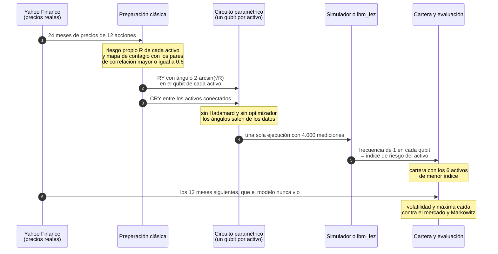

# Quantum Portfolio Risk

[](LICENSE)
[](https://www.python.org/)
[](https://github.com/Qiskit/qiskit)
[](https://quantum.cloud.ibm.com)
[](#resultados-en-hardware-real)
[](https://frcu.utn.edu.ar/index.php/escuela-cacic/cursos-cacic)

**[Sitio web](https://314-ia.github.io/quantum-portfolio-risk/)** · **[Notebook en línea](https://314-ia.github.io/quantum-portfolio-risk/notebook.html)** · **[Diapositivas en PDF](CACIC/presentacion/Aplicaciones_Financieras_Computacion_Cuantica_CACIC2026.pdf)** · **[English](https://314-ia.github.io/quantum-portfolio-risk/en/)**

> Material educativo y de investigación. **No es una recomendación de inversión y no demuestra ventaja cuántica:** estos circuitos se pueden simular en una laptop y un método clásico logra carteras de menor riesgo. Ver [Qué se puede afirmar y qué no](#qué-se-puede-afirmar-y-qué-no).

Circuitos cuánticos paramétricos para **estimar el riesgo de cada activo de una cartera de inversión**, armados con precios reales de mercado y ejecutados en simuladores y en una computadora cuántica de IBM. Los ángulos del circuito se calculan directamente de los datos históricos, sin el bucle de optimización que usan VQE y QAOA.

Este repositorio contiene el material de la clase **Aplicaciones Financieras en la Computación Cuántica**, dictada en la Escuela Internacional de Informática del CACIC 2026: las diapositivas y un notebook de Qiskit listo para correr.

> **Trabajo de referencia:** J. P. Braña, A. M. J. Litterio, A. Fernández et al., *A Parametric Quantum Circuit for Portfolio Risk Assessment at 110 Qubits: Three-Way Validation and a Demonstrator of the Path to Advantage via Amplitude Estimation*, aceptado en QCQSE-Chile, JCC 2026.

> **In English.** Parametric quantum circuits that estimate a per-asset risk index for an investment portfolio, built from real market data and run on simulators and on IBM Quantum hardware. The circuit angles are computed directly from historical data, with no optimization loop. This repository holds the material of a class taught in Spanish at the CACIC 2026 school: the slides and a ready-to-run Qiskit notebook.

## Cómo se compone el método

<p align="center">
  
</p>

La animación usa los datos reales de la clase: el giro de cada flecha sale del riesgo del activo y las barras son el índice medido en `ibm_fez`. El mismo recorrido, paso a paso:



Lo que distingue al método: **los ángulos salen de una fórmula y no de un optimizador**. Por eso alcanza con una sola ejecución del circuito, y un qubit por activo permite llegar a 110 activos en un procesador actual. El notebook también muestra por qué el circuito no arranca con compuertas Hadamard: con ellas la lectura se pliega y dos riesgos distintos dan el mismo resultado.

## Resultados en hardware real

| Experimento | Procesador | Qubits | Diferencia promedio con el ideal |
|---|---|---|---|
| Clase, 4 de octubre de 2026 | `ibm_fez` | 12 | 0,015 |
| Trabajo de referencia, 27 de junio de 2026 | `ibm_fez` | 110 | 0,10 |

El circuito de 12 qubits se ejecutó una sola vez, con 4.000 mediciones y 3 segundos de procesador: trabajo `db1djj3id5ic73er0ceg`. La cartera armada con el resultado real elige los mismos seis activos que la versión ideal.

Evaluación de las carteras con 12 meses de datos que el modelo nunca vio:

| Cartera | Rendimiento | Volatilidad anual | Máxima caída |
|---|---|---|---|
| Markowitz, mínimo riesgo | +20,8 % | 9,6 % | −4,4 % |
| Circuito cuántico, hardware real | +26,7 % | 11,9 % | −9,6 % |
| Modelo clásico de difusión | +24,0 % | 12,1 % | −10,5 % |
| SPY, el mercado | +31,1 % | 12,5 % | −8,9 % |

El objetivo del método es bajar el riesgo, así que las columnas que importan son la volatilidad y la máxima caída. La tabla completa y el detalle por activo están en la [guía de la clase](CACIC/README.md).

## Qué se puede afirmar y qué no

- **El circuito corre en hardware actual.** Con 12 qubits el resultado real casi coincide con el ideal. Con 110 qubits el ruido crece y el orden general de riesgo se mantiene.
- **No hay ventaja cuántica.** Estos circuitos se pueden simular en una laptop, y un método clásico como el de Markowitz logra carteras de menor riesgo.
- **El valor está en el método de validación.** El circuito se compara contra su versión ideal y contra un modelo clásico, y el paso siguiente es usarlo dentro de la estimación de amplitud cuántica.

## Cómo correrlo

```bash
git clone https://github.com/314-ia/quantum-portfolio-risk.git
cd quantum-portfolio-risk/CACIC
python3 -m venv .venv
.venv/bin/pip install -r notebook/requirements.txt
.venv/bin/jupyter lab notebook/Finanzas_Cuanticas_CACIC2026.ipynb
```

- Las versiones fijadas exigen Python 3.12 como mínimo. Se probó con Python 3.13.
- El notebook corre de arriba hacia abajo en alrededor de un minuto. Todo lo cuántico se ejecuta en simuladores, salvo un paso opcional que envía el circuito a una computadora real de IBM.
- Los precios se bajan de Yahoo Finance al ejecutar.
- Cómo correr en hardware real, y más detalle, en la [guía de la clase](CACIC/README.md).

## Contenido

- [`CACIC/notebook/Finanzas_Cuanticas_CACIC2026.ipynb`](CACIC/notebook/Finanzas_Cuanticas_CACIC2026.ipynb): el notebook de la clase, ya ejecutado, con salidas y figuras
- [`CACIC/presentacion/`](CACIC/presentacion/): las 25 diapositivas en PDF, con un anexo que explica el notebook sección por sección
- [`CACIC/notebook/datos/`](CACIC/notebook/datos/): resultado real del circuito de 12 qubits y datos del experimento de 110 qubits
- [`CACIC/material_extra/figuras/`](CACIC/material_extra/figuras/): las figuras de las diapositivas
- [`CACIC/README.md`](CACIC/README.md): la guía de la clase
- [`docs/`](docs/): el [sitio web](https://314-ia.github.io/quantum-portfolio-risk/) del proyecto, con el notebook ejecutado para leer en línea
- [`assets/`](assets/): la animación del método y los guiones que generan la animación y la página del notebook

Está previsto sumar más adelante el código del trabajo de investigación en el que se basa la clase.

## Contexto

La teoría moderna de carteras de Markowitz busca la combinación de activos con menor riesgo para un rendimiento dado. Los optimizadores cuánticos más conocidos, VQE y QAOA, atacan ese problema con un circuito cuyos ángulos ajusta un optimizador clásico, en un bucle de muchas ejecuciones.

Este trabajo toma otro camino: no optimiza, mide. Carga en cada qubit el riesgo propio de un activo, agrega el contagio entre activos correlacionados con compuertas controladas y lee un índice de riesgo por activo. La clase recorre los dos caminos con los mismos datos y los compara con el método clásico.

La clase forma parte del Curso 3, "Fundamentos e Intuición del Cómputo Cuántico – De los Principios a sus Aplicaciones", de la XXX Escuela Internacional de Informática del CACIC 2026, en la UTN Facultad Regional Concepción del Uruguay, del 5 al 9 de octubre de 2026.

## Cómo citar

Para citar el **material del curso**, este repositorio:

```bibtex
@misc{brana2026finanzascuanticas,
  author       = {Brana, Juan Pablo and Fernandez, Alejandro and Litterio, Alejandra M. J.},
  title        = {Aplicaciones Financieras en la Computaci{\'o}n Cu{\'a}ntica},
  year         = {2026},
  howpublished = {Material del curso, XXX Escuela Internacional de Inform{\'a}tica, CACIC 2026},
  url          = {https://github.com/314-ia/quantum-portfolio-risk}
}
```

Para citar el **método**, el trabajo de referencia:

```bibtex
@inproceedings{brana2026parametric,
  author    = {Brana, Juan Pablo and Litterio, Alejandra M. J. and Fernandez, Alejandro and others},
  title     = {A Parametric Quantum Circuit for Portfolio Risk Assessment at 110 Qubits: Three-Way Validation and a Demonstrator of the Path to Advantage via Amplitude Estimation},
  booktitle = {Workshop Chileno de Computaci{\'o}n Cu{\'a}ntica e Ingenier{\'i}a de Software Cu{\'a}ntico (QCQSE-Chile), JCC 2026},
  year      = {2026},
  note      = {Aceptado}
}
```

## Licencia

MIT: ver [LICENSE](LICENSE). Los precios de mercado provienen de Yahoo Finance y no se redistribuyen en este repositorio: el notebook los descarga al ejecutarse.

## Autores

- Juan Pablo Braña, CAETI, Universidad Abierta Interamericana
- Alejandro Fernández, LIFIA, Universidad Nacional de La Plata
- Alejandra M. J. Litterio, CAETI, Universidad Abierta Interamericana
